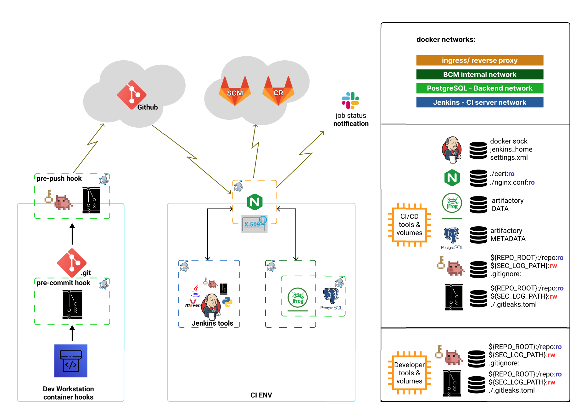

# oss-ci-on-prem

A reproducible **on-premise DevSecOps CI/CD lab** built entirely from open-source components.  
Designed for **shift-left security**, reproducibility, and precision in build/test pipelines.

---

## Architecture Overview

### Core Stack

- **Jenkins LTS** with full JDK toolchains (8-21), Maven 3.9.11, Docker CLI + Compose plugin.
- **JFrog Artifactory OSS7** with multi-repository layout (snapshots, releases, virtuals).
- **PostgreSQL 16** backend database.
- **NGINX/OpenResty reverse proxy** with:
    - TLS termination (Let’s Encrypt DNS-01 challenge, API-based automated renewal).
    - Hardened headers (HSTS, CSP).
    - JSON access logs.
- **Prometheus + Grafana + Loki + promtail** observability stack.

### Networking Model

- `ingress_net` - TLS termination + reverse proxy.
- `bcm_internal_net` - internal service comms.
- `postgres_net` - DB isolation.
- `jenkins_net` - CI server-only traffic.

All services run in **segregated Docker networks**, east-west traffic is routed through NGINX.  
Only ports `80/443` are exposed to the host.

---




---

## Environment Showcase

| Section           | Example A | Example B |
| ----------------- | --------- | --------- |
| Jobs              |  |  |
| Certificates      |  |  |
| Toolchains / Jobs |  |  |
|                   |  |  |
| Scans             | <br> |  |

---

## project tree: 
```
├── docker-compose-artifactory.yaml
├── docker-compose-jenkins.yaml
├── docker-compose-monitoring.yaml
├── docker-compose-nginx.yaml
├── net-plan
│   └── network-arch
├── README.md
├── docs
├── LICENSE
├── container-mng
│   ├── artifactory
│   │   ├── init-artifactory-sidecar.sh
│   │   └── system.yaml
│   ├── jenkins
│   │   ├── Dockerfile
│   │   ├── entrypoint.sh
│   │   └── maven_client
│   │       ├── settings-security.xml
│   │       ├── settings.xml
│   │       └── toolchains.xml
│   ├── nginx
│   │   ├── nginx.conf.template
│   │   └── rev_proxy_entrypoint.sh
│   ├── postgres
│   │   ├── init-postgres-sidecar.sh
│   │   └── init-psql-db.sh
│   ├── security-tools              # (shift left dev workstation)
│   │   └── docker-compose.yaml     # Trufflehog + gitleaks
│   ├── monitoring                  # monitoring stack - mid implementation
│   │   ├── docker-compose-monitoring.yaml
│   │   ├── grafana
│   │   │   └── provisioning
│   │   │       ├── dashboards
│   │   │       └── datasources
│   │   │           └── datasource.yaml
│   │   ├── loki
│   │   │   └── loki-config.yaml
│   │   ├── prometheus
│   │   │   └── prometheus.yaml
│   │   └── promtail
│   │       └── promtail-config.yaml
├── _mng                             # env management (not uploaded)
│   ├── backups                      # automation: deploy, hooks , bkp, destroy
│   │   └── grand-pom.xml
│   ├── env-logs
│   ├── scripts                      
│   ├── secrets
│   │   └── .env_file_dir
│   └── security
│       └── logs
│           ├── pre-commit
│           └─── pre-push
```

---

## Developer Workstation Security

Git hooks enforce early secret detection and scanning:

- **Pre-commit hook**
    - `gitleaks` runs on staged code.
- **Pre-push hook**
    - `trufflehog` + `gitleaks` run before GitHub push.
- **Execution model**
    - Both scanners run inside hardened Docker containers.
    - Mounted volumes:
        - `${REPO_ROOT}:/repo:ro`
        - `${SEC_LOG_PATH}:/logs:rw`
    - Logs written to `_mng/security/logs`.

This prevents credential leaks and enforces **fail-fast security** before CI/CD resources are consumed.  
The same scanning containers are also mounted in **Jenkins pipelines** to enforce parity between local and CI environments.

---

## CI/CD Environment

### Jenkins

- Runs on JDK21 (default), with legacy toolchains (8, 11, 17).
- Pipelines configured with:
    - **Multi-named `settings.xml`** (repo endpoints, mirrors).
    - **toolchains.xml** (auto JDK selection per build).
- Integrated with GitLab SCM + Container Registry.
- Slack notifications for build status.

### Artifactory

- Configured with `system.yaml` via sidecar init container.
- Repo layout:
    - `libs-release-local`
    - `libs-snapshot-local`
    - `libs-virtual` (aggregation).
- All artifact routing forced through **NGINX TLS termination**. No direct bypass of HTTPS allowed.

### PostgreSQL

- Initialized with `init-postgres-sidecar.sh` and `init-psql-db.sh`.
- Schema and user creation scripted, idempotent across rebuilds.
- Volumes separated for DATA and METADATA.

### NGINX

- TLS certs mounted at runtime (`cert/fullchain.pem`, `cert/privkey.pem`).
- Automated renewal via ACME DNS-01 challenge using API tokens from secondary DNS provider.
- Only reverse proxy exposed. Jenkins and Artifactory have **no host ports** bound.

---

## Monitoring & Observability

- **Prometheus**: metrics collection.
- **Grafana**: dashboards + alerting.
- **Loki** + **promtail**: log aggregation.
- All monitoring containers scaffolded under `container-mng/monitoring/`.
- Init scripts validate volume mounts and environment configs before startup.

---

## Security Model

- **Secrets**:
    - Stored in `.env_containers/*` (not committed).
    - Mounted at runtime via environment files and Docker secrets.
- **Exposure**:
    - Only NGINX listens on host (80/443).
    - All east-west traffic contained in Docker networks.
- **Uploads**:
    - Large file uploads routed through NGINX with size limits enforced.
- **Headers**:
    - HSTS, CSP, and hardened defaults enabled in `nginx.conf.template`.

---

## Usage

### Prerequisites

- Docker Engine + Compose plugin.
- Domain with DNS provider supporting API-based DNS-01 ACME validation.
- TLS certs provisioned and mounted into `./cert/`.

### Setup

1. Prepare `.env_containers/` with:
    - `ART_USER`, `ART_TOKEN`, `ENV_DOMAIN`, `SERVER_NAME_JENKINS`, `SERVER_NAME_ARTI`.
2. Mount TLS certs into:
    - `cert/fullchain.pem`
    - `cert/privkey.pem`
3. Start services:


```bash
docker compose \
  -f docker-compose-nginx.yaml \
  -f docker-compose-artifactory.yaml \
  -f docker-compose-jenkins.yaml \
  -f docker-compose-monitoring.yaml up -d
```

### Access

- Jenkins: `https://jenkins.${ENV_DOMAIN}`
- Artifactory: `https://arti.${ENV_DOMAIN}`
- Grafana: `https://grafana.${ENV_DOMAIN}`

---

## Roadmap

- **monitoring stack**: Move behind NGINX SSL termination.
- **IaC**: Terraform modules for reproducible infra.
- **Kubernetes**: full orchestration + GitOps via Argo CD.
- **Secrets**: HashiCorp Vault / OpenBao integration.
- **Security stages**: SAST, SCA, SBOM generation, container scans.
- **Cloud portability**: reproducible on AWS free-tier.

---

## Limitations

- Demo-focused. no HA/DR or automated backup orchestration.
- WAF/rate limiting not yet implemented.
- Monitoring stack scaffolding still WIP.

## Current Status
- Security hooks (gitleaks + trufflehog) integrated
- Jenkins, Artifactory, Nginx stacks operational
- Monitoring stack (Prometheus, Grafana, Loki, Promtail) scaffolded - WIP
