# oss-ci-on-prem:
@chena: On-premise CI/CD lab using open-source stack (Jenkins, GitLab, Artifactory/OSS7, Postgres/16, NGINX/OpenResty TLS termination, Docker Compose). Includes TLS via Let’s Encrypt and segregated Docker networks for service isolation. Built from scratch to showcase DevSecOps practices.


# On premise CI Environment - Jenkins, Artifactory, Nginx

This project provides a reproducible on-prem CI/CD environment.  
The stack includes Jenkins with JDK21 + Maven, JFrog Artifactory OSS, PostgreSQL backend, and an Nginx reverse proxy with TLS termination.  
All containers are orchestrated with Docker Compose and parameterized through `.env` files. Secrets, certificates, and environment values are never committed - they are mounted at runtime.

---

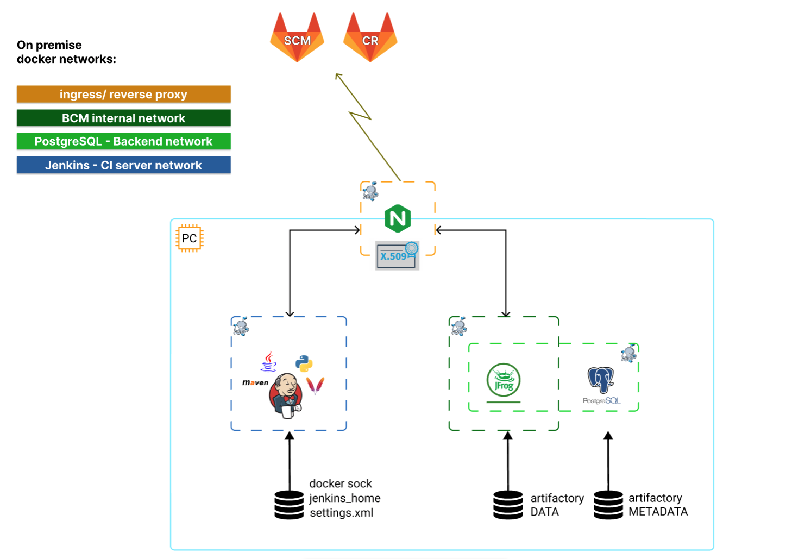

---

## project tree: 
```
.
├── .gitignore
├── README.md
├── container-mng
│   ├── artifactory
│   │   ├── init-artifactory-sidecar.sh
│   │   └── system.yaml
│   ├── jenkins
│   │   ├── Dockerfile
│   │   ├── entrypoint.sh
│   │       ├── settings-security.xml
│   │       ├── settings.xml
│   │       └── toolchains.xml
│   ├── nginx
│   │   ├── nginx.conf.template
│   │   └── rev_proxy_entrypoint.sh
│   └── postgres
│       ├── init-postgres-sidecar.sh
│       └── init-psql-db.sh
├── docker-compose-artifactory.yaml
├── docker-compose-jenkins.yaml
└── docker-compose-nginx.yaml
```

---

## Environment Showcase

| Section           | Example A | Example B |
| ----------------- | --------- | --------- |
| Jobs              | 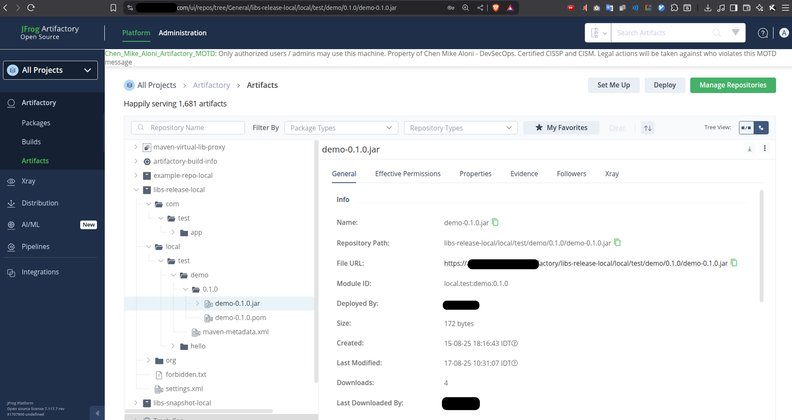 | 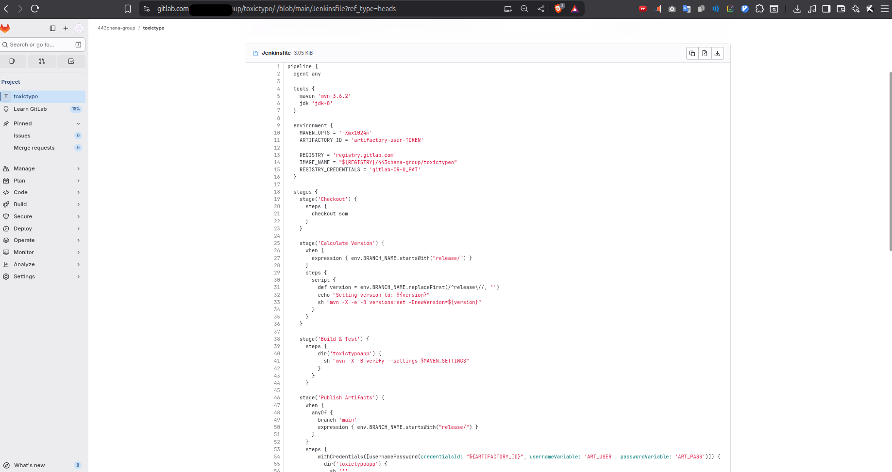 |
| Certificates      | 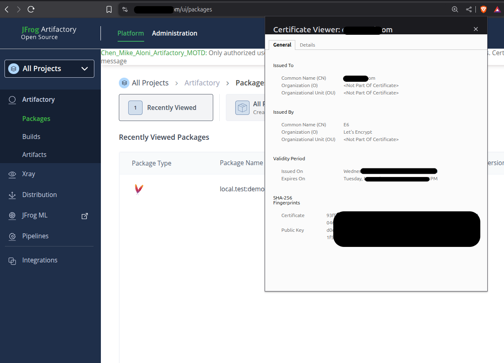 | 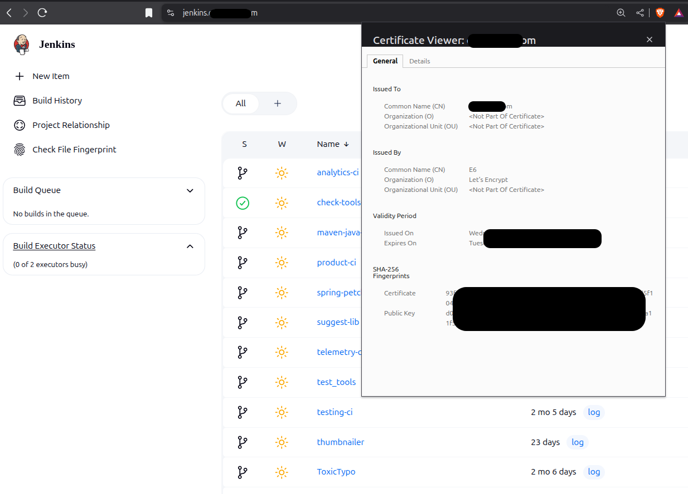 |
| Toolchains / Jobs | 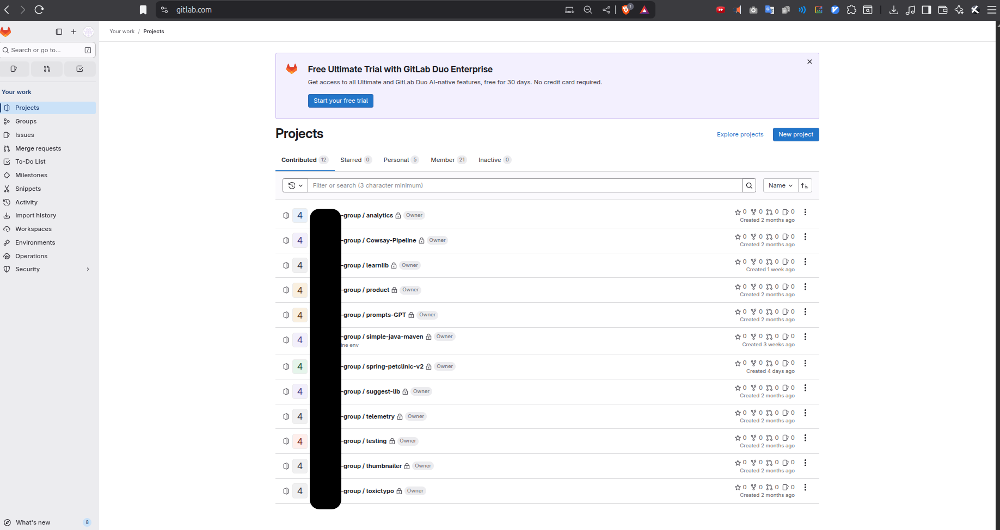 | 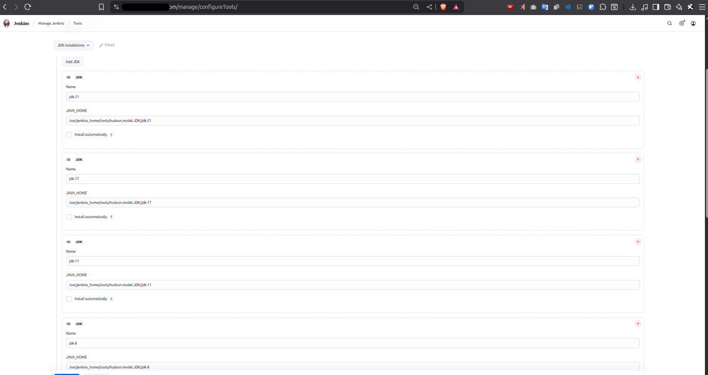 |
|                   | 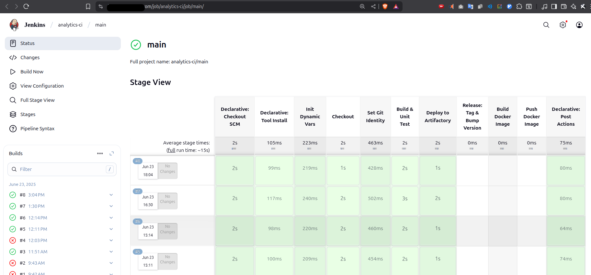 | 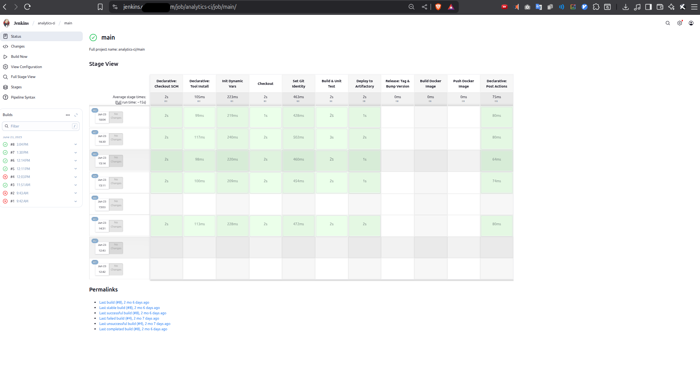 |
| Scans             | 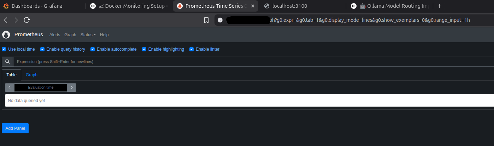<br>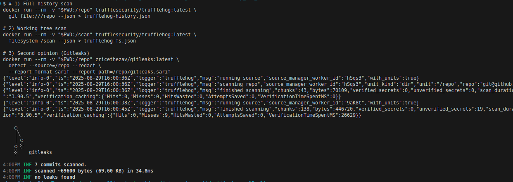 | 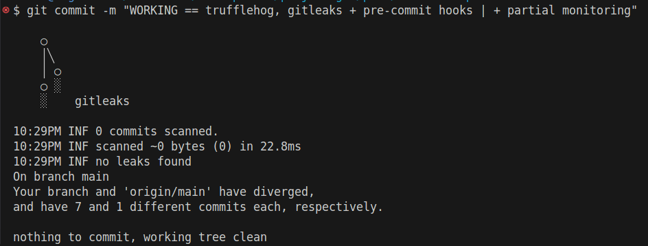 |

---

## Components
- **Jenkins**: LTS with JDK21, Docker CLI + Compose plugin, Maven toolchains, custom entrypoint for environment prep.
- **Artifactory OSS**: Routed through Nginx, configured with sidecar init script and `system.yaml`.
- **PostgreSQL**: Dedicated init scripts for schema and user setup.
- **Nginx (OpenResty)**: Reverse proxy with SSL termination, JSON logs, and hardened headers.

---

## Usage
1. Prepare `.env_containers` with required variables (`ART_USER`, `ART_TOKEN`, domain, ports, etc).
2. Place TLS certs in mounted volume paths (`cert/fullchain.pem`, `cert/privkey.pem`) - not in repo.
3. Start the stack:
```sh
       docker compose -f docker-compose-nginx.yaml -f docker-compose-artifactory.yaml -f docker-compose-jenkins.yaml up -d
```
4. Access services:
- Jenkins: https://jenkins.<your-domain>
- Artifactory: https://arti.<your-domain>

## Notes

- Secrets, backups, logs, and real certificates are excluded from git and .gitignore enforces that.
- The provided config files are templates for reproducible builds and safe to share publicly.
- Designed for demonstration and learning purposes – not production hardened.


---

## Architecture
- **Ingress:** Nginx terminates TLS and routes to internal services.
- **East-west:** Nginx talks HTTP to Jenkins and Artifactory over Docker networks only.
- **State:** Artifactory data and Postgres volumes are named volumes. Backups handled outside the repo.
- **Build flow (high level):**
  1. Developer pushes to GitLab
  2. Jenkins builds with JDK21 + Maven
  3. Artifacts published to Artifactory via settings.xml
  4. Optional container images pushed to a registry (future)


---

## TLS and DNS
- TLS termination at Nginx with `fullchain.pem` and `privkey.pem` mounted at runtime.
- Certificates are not stored in git.
- `nginx.conf.template` uses `${SERVER_NAME_JENKINS}` and `${SERVER_NAME_ARTI}` to keep domains configurable.

## Let’s Encrypt with DNS-01 (free DNS API approach)
When your domain registrar lacks a free API, point only the subdomains you use for CI to a DNS provider that offers a free API and ACME DNS-01 support. Example flow:
1. Keep your main domain at Registrar A.
2. Delegate CI subdomains to Provider B that has an API (e.g. `jenkins.example.com`, `arti.example.com`).
3. Use an ACME client that supports DNS-01 with Provider B’s API token to obtain/renew certs offline.
4. Mount `fullchain.pem` and `privkey.pem` into the Nginx container.

**Why DNS-01:** no inbound ports needed, works behind NAT, compatible with internal-only services.

## Environment variables
- All sensitive values are in `.env_containers/*` and not committed.
- Example variables: `ENV_DOMAIN`, `SERVER_NAME_JENKINS`, `SERVER_NAME_ARTI`, `ART_USER`, `ART_TOKEN`.

## Security model (concise)
- No secrets in repo. Secrets mounted via env files and volumes.
- Only Nginx exposes ports 80 and 443.
- Jenkins and Artifactory are not directly exposed on the host.
- Large uploads allowed only at Nginx. Headers hardened (HSTS, CSP).

---

## Limitations
- Demo-focused. No HA, no backups automation in this repo, no WAF, no rate limiting.

## Roadmap
- Jenkins Multibranch + GitLab integration
- SBOM generation and signing
- Image scan and attest
- Automated DNS-01 renewals via cron job container


## Current Status
- Security hooks (gitleaks + trufflehog) integrated
- Jenkins, Artifactory, Nginx stacks operational
- Monitoring stack (Prometheus, Grafana, Loki, Promtail) scaffolded — WIP
